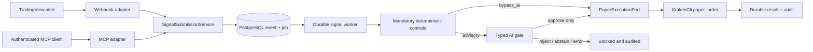

# TradingView Signal Routes — Implementation Plan

Status: **implemented (V1 scaffolding — flags off by default)**  
Scope: `D:\Neo_Fabel` active FastAPI/React application only. The legacy `fable-5-masterprompt-os (2)` copy, external MCP providers, live Kraken infrastructure, and live trading are out of scope.

Implementation notes (2026-07-18): Phases 0–8 landed with safe defaults. Production AI provider, Firebase `signal_admin` claim lifecycle, TradingView alert `signal_id` template, and Kraken paper client-order-id reconciliation remain human-review gates before enabling canary flags.

## 1. Intended outcome

Add a new main-menu tab named **Signal Routes** where an authenticated user can configure TradingView webhook and MCP signal ingress, select a per-route review mode, rotate credentials, and inspect a durable processing history.

Both modes remain Kraken paper-only in V1:

- `bypass_ai`: skip only the AI review stage.
- `advisory`: require a typed AI `approve` decision before paper submission.

Authentication, strict parsing, replay protection, deterministic guardrails, route/global kill switches, audit logging, and the paper-only boundary are mandatory in both modes. No feature module may import or call `Level4Session`, `execute_order`, `place_order`, or enable Kraken trade commands.

## 2. Decisions fixed by this plan

1. Use the TradingView webhook as the primary ingress. TradingView posts a strict JSON alert to a public route-specific endpoint.
2. Add MCP as a second, separately authenticated adapter over the same submission service; MCP never gets its own execution logic.
3. Persist the event and a worker job in one PostgreSQL transaction, return `202 Accepted`, then process it in a separate durable worker.
4. Default every route to `advisory`, `disabled`, and immutable `execution_target = kraken_paper`.
5. Label the user-facing switch **Bypass (AI off)** and **Advisory (AI gate)**. “Bypass” never means bypassing controls.
6. Advisory AI may only return `approve`, `reject`, or `abstain`. It cannot rewrite pair, side, volume, type, or price. Every non-approve outcome fails closed.
7. The signal worker constructs a narrow paper-only execution adapter and calls only `KrakenCli.paper_order()`.
8. Use PostgreSQL row leasing with `FOR UPDATE SKIP LOCKED`; do not use FastAPI `BackgroundTasks`, Redis, or Celery for V1.
9. An uncertain result after the Kraken subprocess starts becomes `execution_unknown` and is never automatically retried.
10. Preserve the existing manual `/api/v1/paper/orders` behavior while extracting its reusable paper-order service.

## 3. Target architecture



Dispatch is permitted only when all conditions are true:

```text
SIGNAL_ROUTES_ENABLED
AND SIGNAL_EXECUTION_ENABLED
AND route.enabled
AND route.execution_target == "kraken_paper"
AND worker startup paper-only assertions passed
AND credential remains valid
AND deterministic policy passed
AND no duplicate/expired/conflicting event exists
AND (
  effective_mode == "bypass_ai"
  OR effective_mode == "advisory" AND ai_decision == "approve"
)
```

The receipt-time mode is snapshotted. Immediately before dispatch, current configuration may only make processing more restrictive: route/global disable blocks; current tighter caps are rechecked; and the effective mode is Advisory if either the snapshot or current mode is Advisory. A later switch to Bypass can therefore never downgrade an already queued Advisory event.

## 4. Ingress contracts

### 4.1 TradingView webhook

Endpoint:

```http
POST /api/v1/webhooks/tradingview/{public_route_key}
Content-Type: application/json
```

`public_route_key` locates the route but is not the credential. The route credential is a separately generated 256-bit token placed in the TradingView JSON body because TradingView alerts cannot be assumed to set a custom authorization header.

Strict V1 body:

```json
{
  "schema_version": 1,
  "credential": "tvsec_one_time_value",
  "signal_id": "BPRC_PRO:Long:1784301420000",
  "occurred_at": "2026-07-18T12:37:00Z",
  "strategy_id": "BPRC_PRO",
  "pair": "ADAUSD",
  "side": "buy",
  "volume": "100",
  "order_type": "market",
  "price": null,
  "order_id": "Long",
  "raw_symbol": "KRAKEN:ADAUSD",
  "observed_price": "0.45"
}
```

Contract rules:

- Forbid unknown fields and bound every string, collection, decimal precision, JSON depth, and total body size.
- Require an Tradingview-Pair; always infer from a TradingView symbol.
- Accept only canonical UTC timestamps within the configured freshness/future-skew window.
- Use strict decimal parsing: no exponent, NaN, infinity, zero, or negative volume.
- Remove `credential` before canonical persistence, AI evaluation, tracing, and logging.
- Require a stable `signal_id`. A duplicate with the same canonical hash returns the original receipt; the same ID with different content is a terminal security conflict.
- Return a generic authentication failure for both an unknown route and a wrong credential.
- Return `202` only after the event, job, and first audit transition commit.

Receipt:

```json
{
  "submission_id": "uuid",
  "receipt_status": "accepted_for_processing",
  "replayed": false,
  "execution_target": "kraken_paper",
  "request_id": "server-generated-uuid"
}
```

### 4.2 MCP adapter

Expose one route-scoped tool only:

```text
submit_trading_signal(
  idempotency_key,
  occurred_at,
  strategy_id,
  pair,
  side,
  volume,
  order_type,
  price?,
  observed_price?
) -> same receipt contract
```

Authenticate the MCP transport with a separately issued, route-scoped bearer credential. Bind the route and adapter identity from the credential rather than accepting them as tool arguments. The tool cannot administer routes, select a mode/target, supply an AI verdict, override policy, or pass arbitrary CLI/provider fields. Keep the MCP adapter disabled by default.

### 4.3 Firebase-protected browser APIs

- `GET /api/v1/signal-automation/status`
- `GET /api/v1/signal-routes`
- `POST /api/v1/signal-routes`
- `GET /api/v1/signal-routes/{route_id}`
- `PATCH /api/v1/signal-routes/{route_id}` with `expected_version`
- `POST /api/v1/signal-routes/{route_id}/credentials/tradingview/rotate`
- `POST /api/v1/signal-routes/{route_id}/credentials/mcp/rotate`
- `POST /api/v1/signal-routes/{route_id}/credentials/{credential_id}/revoke`
- `GET /api/v1/signal-submissions?route_id=&source=&status=&cursor=&limit=`
- `GET /api/v1/signal-submissions/{submission_id}`

Add `require_signal_admin`: validate the Firebase bearer, a `signal_admin` custom claim, route ownership, and recent authentication for credential rotation or a switch to Bypass. Cross-owner resources return a non-enumerating response. Stale route writes return `409 route_version_conflict`.

## 5. Persistence and state

Add an Alembic migration with string columns plus database check constraints rather than PostgreSQL enums.

### `signal_routes`

- `id`, `owner_user_uid`, non-secret unique `public_route_key`, `name`, `strategy_id`
- `mode`: `bypass_ai | advisory`
- `enabled`: default `false`
- `execution_target`: constrained to `kraken_paper`
- pair allowlist, maximum volume/notional, allowed order types, maximum event age, rate/backlog/open-exposure caps
- `policy_version`, optimistic `version`, timestamps

### `signal_route_credentials`

- `id`, `route_id`, `kind`: `tradingview_secret | mcp_bearer`
- HMAC-SHA-256 digest using a versioned server pepper; plaintext is never persisted
- display prefix, activation/expiry/revocation timestamps, `last_used_at`
- reveal plaintext exactly once on creation/rotation

### `signal_events`

- route/source/token identity, `signal_id`, canonical-payload hash, schema version
- typed canonical order fields and bounded non-secret metadata
- receipt-time mode, route version, policy version, request ID
- current status/reason, paper intent reference, timestamps
- unique `(route_id, source, signal_id)` and conflict detection using the canonical hash

### `signal_jobs`

- one unique job per event
- `ready | leased | retry_wait | complete | dead`
- attempts, availability, lease owner/expiry, last bounded error code, timestamps

### `signal_evaluations`

- one row per Advisory event
- `approve | reject | abstain | timeout | error`
- controlled reason codes, candidate hash, provider/model/prompt/policy versions, latency
- no chain-of-thought, secret, raw prompt, or unrestricted model response

### `signal_audit_events`

- append-only processing/configuration transitions with actor kind, pseudonymous subject, route/event/request IDs, versions, reason code, and timestamp
- no credential, bearer, raw body, AI prompt, or unrestricted Kraken stdout/stderr

### Existing `paper_order_intents`

Add `source` (`manual | signal`) and nullable `source_ref`, with a unique partial constraint for signal-source references. The event UUID becomes the deterministic internal idempotency key. Existing rows default to `manual` and remain compatible.

Event state machine:

```text
received -> queued -> validating
  -> rejected_validation
  -> rejected_guardrail
  -> evaluating_advisory
       -> rejected_advisory
       -> failed_closed
       -> approved
  -> bypass_approved
  -> paper_submitting
       -> paper_accepted
       -> paper_failed
       -> execution_unknown
```

Before the paper subprocess begins, commit a unique execution claim. If the process may have started but the result is missing, record `execution_unknown`, alert the operator, and do not redispatch. Exactly-once execution cannot be promised until the Kraken paper CLI is proven to support a downstream client-order ID plus reconciliation.

## 6. Backend implementation map

### Add

- `backend/app/paper_orders.py` — reusable manual/signal paper-order application service.
- `backend/app/signals/__init__.py`
- `backend/app/signals/domain.py` — immutable candidate, enums, legal transitions.
- `backend/app/signals/schemas.py` — strict webhook, admin, receipt, and history DTOs.
- `backend/app/signals/auth.py` — TradingView/MCP credential generation, digest, verification, rotation.
- `backend/app/signals/repository.py` — transactions, dedupe, leases, optimistic route updates.
- `backend/app/signals/service.py` — canonical `SignalSubmissionService` and route/history use cases.
- `backend/app/signals/policy.py` — deterministic parsing, freshness, pair/size/rate/exposure checks.
- `backend/app/signals/evaluator.py` — provider-neutral typed `SignalEvaluator` protocol.
- `backend/app/signals/executor.py` — `PaperExecutionPort`; only this adapter reaches `PaperOrderService`.
- `backend/app/signals/router.py` — TradingView ingress and Firebase-protected admin APIs.
- `backend/app/signals/mcp_server.py` — authenticated MCP transport and `submit_trading_signal` adapter.
- `backend/app/signals/worker.py` — PostgreSQL lease loop, retry policy, heartbeat, recovery.
- `backend/app/integrations/ai_evaluator.py` — concrete backend-only provider adapter after provider approval.
- `backend/migrations/versions/0002_signal_routes.py`

### Modify

- `backend/app/main.py` — register routers and composition only; extract current paper endpoint logic.
- `backend/app/models.py` — add the route/event/job/evaluation/audit models and paper-intent source fields.
- `backend/app/auth.py` — add role/recent-auth helpers without weakening `require_user`.
- `backend/app/settings.py` — add disabled-by-default feature, worker, credential, and AI settings.
- `backend/app/integrations/kraken_cli.py` — preserve discrete argv and validation; no live-path expansion.
- `backend/pyproject.toml` — add the selected AI and MCP adapter dependencies and retain lint/test tooling.
- `docker-compose.yml` — add a separate signal-worker process using the API image and no live Kraken credentials.
- `nginx.conf` — 16 KiB webhook cap, strict timeouts, route/IP throttling, safe correlation headers, no credential/body logging.
- `.env.example` — document safe flags and secret references, never real secrets.
- `README.md` — document webhook template, MCP tool, worker command, paper-only invariant, status meanings, rotation, and shutdown.

Settings added with safe defaults:

```text
SIGNAL_ROUTES_ENABLED=false
TRADINGVIEW_INGRESS_ENABLED=false
MCP_SIGNAL_ADAPTER_ENABLED=false
SIGNAL_WORKER_ENABLED=false
SIGNAL_EXECUTION_ENABLED=false
AI_ADVISORY_ENABLED=false
SIGNAL_CREDENTIAL_PEPPER=<secret-manager reference>
SIGNAL_MAX_BODY_BYTES=16384
SIGNAL_MAX_AGE_SECONDS=300
SIGNAL_FUTURE_SKEW_SECONDS=30
ADVISORY_PROVIDER=<approved provider>
ADVISORY_MODEL=<pinned model>
ADVISORY_TIMEOUT_SECONDS=5
```

The signal worker must fail startup unless autonomy is exactly paper level, live trading is false, trade commands are disabled, and no live Kraken credential/capability is mounted.

## 7. Advisory evaluator contract

The evaluator receives only the immutable normalized candidate, deterministic results, and bounded trusted market context. It never receives the webhook body, credentials, free-form TradingView text, or URLs and has no tools.

Strict result:

```json
{
  "decision": "approve",
  "reason_code": "canonical_signal_consistent",
  "candidate_hash": "sha256",
  "policy_version": "v1"
}
```

Require `extra = forbid`, exact candidate hash/policy match, pinned provider/model/prompt versions, bounded timeout/tokens, and controlled reason codes. Convert provider errors, timeouts, refusals, malformed output, model mismatch, or hash mismatch to `abstain`. Run deterministic controls again after an AI approval. Bypass code must not instantiate or invoke the evaluator.

The concrete AI provider is a human-review gate. Implement and test the protocol and a deterministic fake first; enable a production adapter only after its provider, model, data handling, and credentials are approved.

## 8. Frontend implementation map

### Add

- `src/features/signalRoutes/SignalRoutesPage.tsx` — page composition.
- `src/features/signalRoutes/api.ts` — typed route, credential, status, and activity requests.
- `src/features/signalRoutes/types.ts` — feature DTOs/state.
- `src/features/signalRoutes/SignalSafetyHeader.tsx`
- `src/features/signalRoutes/SignalRouteList.tsx`
- `src/features/signalRoutes/SignalRouteEditor.tsx`
- `src/features/signalRoutes/SignalCredentialPanel.tsx`
- `src/features/signalRoutes/SignalActivity.tsx`
- `src/features/signalRoutes/SignalEventDetail.tsx`
- `src/auth/firebase.ts` and `src/auth/AuthProvider.tsx` — in-memory/session Firebase state and token provider.
- `src/features/signalRoutes/*.test.tsx` plus API/auth tests.

### Modify

- `src/types.ts` — define one shared `MainTab` including `signals`; keep hidden `full` only if still used.
- `src/App.tsx` — render the page and use the shared tab type.
- `src/components/NavigationMenu.tsx` — add **Signal Routes**, description **TradingView & MCP ingress**, shortcut `5`, and accessible tab semantics.
- `src/api/client.ts` — accept an async token provider, inject Firebase bearer, preserve supplied headers, refresh once on `401`, and expose explicit auth errors.
- `src/main.tsx` — mount the auth provider.
- `package.json` and `vite.config.ts` — add Vitest, React Testing Library, jsdom, and stable full/single-test scripts.

Page information architecture:

1. Persistent **PAPER ONLY** safety header with global gate, worker, ingestion, queue, mandatory-control, AI, and MCP readiness.
2. Route list and selected route editor with enabled state, immutable paper target, pair/size controls, and optimistic version feedback.
3. Accessible native-radio mode selector:
   - **Bypass (AI off):** “Skips AI review only. Authentication, validation, replay protection, deterministic guardrails, paper-only routing, and audit remain enforced.”
   - **Advisory (AI gate):** “AI must approve the canonical signal. Reject, abstain, timeout, or service failure blocks the paper order.”
4. TradingView/MCP setup panels with one-time credential reveal, copy action, rotate/revoke, webhook URL, Pine JSON template, and setup status. Never put credentials in local storage.
5. Activity view with filters and columns for time, route, source, pair/side/volume, mode snapshot, deterministic result, AI verdict, paper result, and request ID. Use a semantic table on desktop and labelled cards on mobile.
6. Event detail with a stage timeline and sanitized canonical payload; never render the raw credential-bearing request.

Switching from Advisory to Bypass requires a confirmation dialog. Enabling a route also requires explicit confirmation and remains ineffective while the global signal gate is off. Retire the current cosmetic `UNGUARDED/UNSAFE` compliance toggle as a security signal on this page; show backend-authoritative read-only control status instead.

Accessibility requirements: proper `nav`/tablist semantics, `aria-selected`, radio group labels/descriptions, dialog focus trap/return, text plus color for status, 44 px touch targets, `aria-live` for saves/copy/status, shortcut suppression in input/textarea/select/contenteditable/dialog, preserved focus during polling, and reduced-motion support.

## 9. Ordered implementation phases

### Phase 0 — contracts and safety prerequisites

1. Record the paper-only architecture decision and schemas/state machine.
2. Add Firebase browser token propagation and `require_signal_admin` ownership/role checks.
3. Sanitize or replace arbitrary inbound `X-Request-ID` values with a server-generated UUID plus bounded external-correlation field.
4. Add static/runtime assertions that the signal feature cannot reach live Kraken methods.

### Phase 1 — reusable paper boundary

1. Extract the current `/api/v1/paper/orders` flow into `PaperOrderService`.
2. Preserve existing manual authentication, idempotency, responses, and tests.
3. Add a narrow `PaperExecutionPort` and fake implementation for signal tests.

### Phase 2 — persistence and disabled admin plane

1. Apply additive migration/models and database constraints.
2. Add Firebase-protected route CRUD, optimistic updates, status/history, credential rotation, and append-only audit.
3. Keep every feature/execution flag off and every new route disabled.

### Phase 3 — TradingView shadow ingestion

1. Add body limits, strict schema, token verification, freshness/conflict/dedupe logic, and atomic event/job/audit insertion.
2. Return the durable `202` receipt.
3. Run in shadow mode: no AI and no paper dispatch.

### Phase 4 — durable worker and deterministic controls

1. Add lease claiming, route ordering, bounded pre-dispatch retries, heartbeat, and recovery.
2. Add durable pair/volume/notional/rate/backlog/exposure policy.
3. Recheck current restrictive settings immediately before dispatch.
4. Prove execution-unknown behavior under crash/timeout injection using a fake sink.

### Phase 5 — Advisory gate

1. Implement the typed evaluator protocol and deterministic fake.
2. Verify every non-approve path fails closed and Bypass never calls AI.
3. Add the approved provider adapter and readiness gate; an Advisory route cannot enable when AI is unavailable.

### Phase 6 — Signal Routes UI

1. Centralize navigation type and add tab/shortcut `5`.
2. Add auth bootstrap, safety header, route editor, mode confirmation, one-time secrets, setup templates, activity, and event detail.
3. Add responsive/accessibility and degraded/auth/conflict states.

### Phase 7 — MCP adapter

1. Add the route-scoped MCP transport credential and single submit tool.
2. Feed the exact same submission service, receipt, policy, worker, and audit path.
3. Prove MCP cannot access administration or select execution/mode/AI behavior.

### Phase 8 — deployment and canary

1. Add worker service, Nginx limits, metrics, alerts, secret-manager mounts, and documentation.
2. Deploy with all flags off; enable shadow ingress for one internal route.
3. Run Advisory shadow, then fake paper sink, then a minimum-size real paper canary.
4. Enable MCP for one separately credentialed route after webhook behavior is stable.
5. GA remains paper-only. Live promotion requires a separate plan, threat model, exchange-native idempotency/reconciliation, durable exposure controls, and explicit human approval.

## 10. Verification gates

Backend tests must prove:

- Safe defaults and database constraints prevent live/invalid targets.
- Unknown route, wrong/revoked/expired token, invalid Firebase role, and cross-owner access fail without disclosure or execution.
- Oversized/deep/duplicate-key/malformed JSON, unknown fields, invalid decimals, stale timestamps, unsupported pair/side/type, and placeholder residue are rejected.
- Concurrent duplicate delivery creates one event, one job, one paper intent, and at most one paper subprocess call.
- Same `signal_id` with changed content becomes a conflict and never executes.
- Bypass makes zero evaluator calls while every mandatory control and audit transition still runs.
- Advisory `approve` sends the unchanged canonical candidate once; reject, abstain, timeout, provider failure, malformed output, and hash/policy mismatch send nothing.
- Route/global disable, credential revocation, tighter policy, and a current Advisory mode prevent a queued event from taking a less restrictive path.
- Multiple workers cannot claim one job; expired leases recover; route event ordering is preserved.
- Crash/timeout after dispatch begins yields `execution_unknown` and never auto-retries.
- Transaction/audit failure rolls back without a sink call.
- Static import checks and a runtime fake make the test suite fail if `Level4Session`, `execute_order`, `place_order`, or live trade commands are touched.
- Secrets/raw bodies are absent from stored rows, API responses, and captured logs.
- MCP uses the same service, is route-scoped, and has no admin/live parameters.
- Alembic upgrade/downgrade and the unchanged manual paper endpoint pass.

Frontend tests must prove:

- The shared five-tab model and shortcut `5` work, including shortcut suppression while editing or in a dialog.
- Firebase bearer injection, single refresh on expiry, logout clearing, and auth-unconfigured/session-expired states.
- Advisory is the default, paper-only is permanent, no live option exists, and Bypass copy states that only AI is skipped.
- Review lowering requires confirmation; route version conflicts do not overwrite newer state.
- One-time credentials mask after dismissal and are never persisted locally.
- Loading, empty, stale, degraded, fail-closed, duplicate, unknown, accepted, and failed states are accurate and keyboard accessible.

Operational acceptance sequence:

1. Create a disabled Advisory route as a Firebase signal admin.
2. Rotate and capture the one-time TradingView credential.
3. Enable the route and submit one harmless paper signal.
4. Confirm receipt, durable transitions, AI approval, and exactly one `kraken paper` invocation.
5. Resend the identical alert and confirm no second invocation.
6. Stub reject, abstain, timeout, malformed output, and provider error; confirm no Kraken invocation.
7. Switch to Bypass; confirm AI is not called while guardrail rejection still works.
8. Submit the equivalent signal over MCP; confirm identical canonical processing.
9. Stop API/worker at controlled transition points; verify durability, lease recovery, and no ambiguous retry.
10. Run:

```powershell
python -m pytest backend/tests
ruff check backend
mypy backend/app --ignore-missing-imports
npm run lint
npm run test
npm run build
```

## 11. Observability and incident controls

Emit structured, allowlisted fields only: request/event/route IDs, source, mode snapshot, stage, outcome, bounded reason code, latency, paper-intent ID, and version identifiers. Never log tokens, request bodies, authorization headers, AI prompts/responses, DB DSNs, or unrestricted Kraken output.

Track ingress outcomes, auth/replay conflicts, queue depth/oldest age, stage latency, deterministic rejections, AI decisions/latency, paper dispatch outcomes, worker heartbeat, and `execution_unknown`. Alert on backlog age, worker loss, authentication spikes, Advisory fail-closed spikes, paper failures, and any attempted live-method reference.

Incident shutdown order: turn off `SIGNAL_EXECUTION_ENABLED`, disable affected routes, revoke credentials, stop the worker, preserve audit/event rows, and reconcile any `execution_unknown` records. Never delete history as part of shutdown.

## 12. Human-review gates before implementation

The recommended architecture is fixed, but these deployment facts require confirmation before their dependent phases:

1. Define the Firebase `signal_admin` claim and whether ownership is single-user or tenant-scoped.
2. Approve the AI provider/model, data handling, secret store, and bounded trusted market-data source.
3. Confirm a TradingView alert template that produces a stable `signal_id` and explicit Kraken pair.
4. Verify whether `kraken paper` supports a client-order ID and reconciliation lookup; until proven, retain at-most-one automatic dispatch and `execution_unknown`.
5. Approve the production MCP client identity/credential lifecycle. Do not hardcode or trust an external MCP URL without a separate authorization and integration review.

No product code, live configuration, external credential, or order path is changed by this plan.
